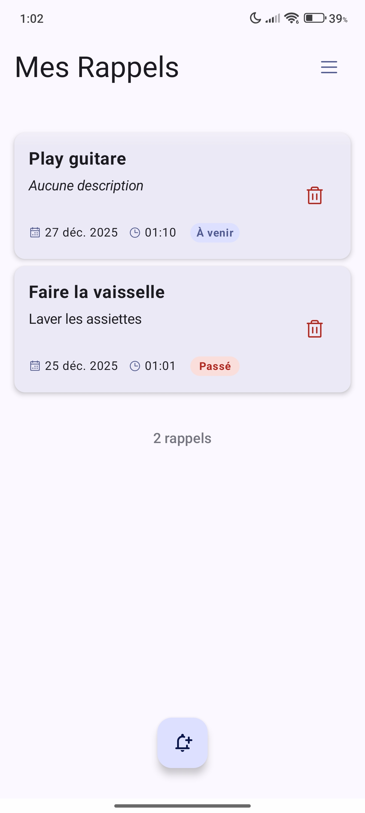

# Reppal 🔔

[English](#english) | [Français](#français)

---

  
  
  
  

---

## English

**Reppal** is a simple and lightweight reminder app. It allows you to schedule occasional alerts for your daily tasks while keeping your data safe.

### Why Reppal?
* 📝 **Simple & Direct**: Create and manage your reminders in just a few taps.
* 🔒 **Privacy First**: No internet connection required -> Your data stays on your phone.
* 🏃 **Lightweight**: A small app size that won't slow down your system.
* 🛠️ **Modern**: Developed with Jetpack Compose.
* 🌍 **Multilingual**: Available in French but also in English, Spanish and German (AI translations).
* ✨ **Quick actions**: Directly add + one hour, or delete the reminder.

---

## Français

**Reppal** est une application de rappels simple et légère. Elle permet de programmer des alertes occasionnelles pour vos tâches quotidiennes tout en garantissant la sécurité de vos données.

### Pourquoi Reppal ?
* 📝 **Simple & Direct** : Créez et gérez vos rappels en quelques clics.
* 🔒 **Vie Privée** : Aucune connexion internet requise -> Vos données restent sur votre mobile.
* 🏃 **Légère** : Une application de petite taille qui n'alourdit pas votre système.
* 🛠️ **Moderne** : Développée avec Jetpack Compose.
* 🌍 **Multilingue** : Disponible en Français mais aussi en Anglais, Espagnol et Allemand (traductions IA).
* ✨ **Actions rapides**: Ajouter directement + une heure, ou supprimer le rappel.

---

## Technical Details / Détails Techniques
- **Minimum Android**: 8.0 (API 26)
- **Target Android**: 15 (API 35)
- **License**: MIT